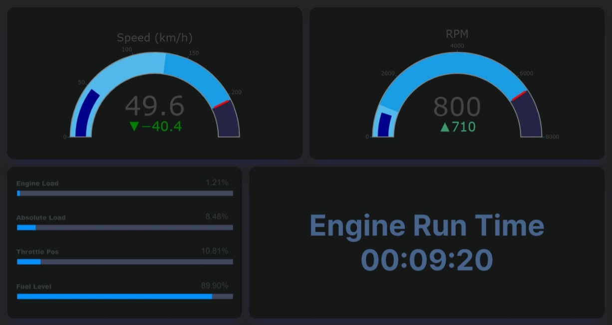
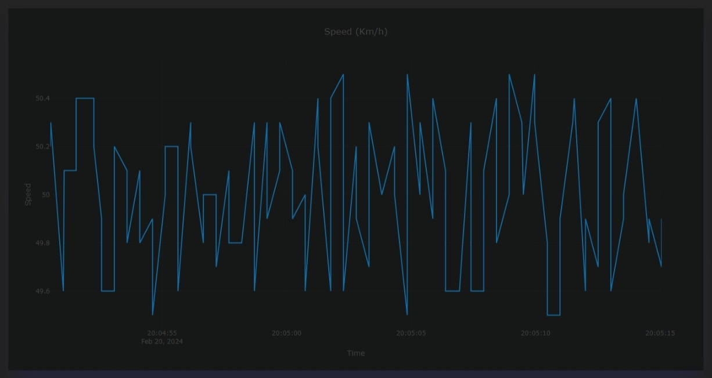
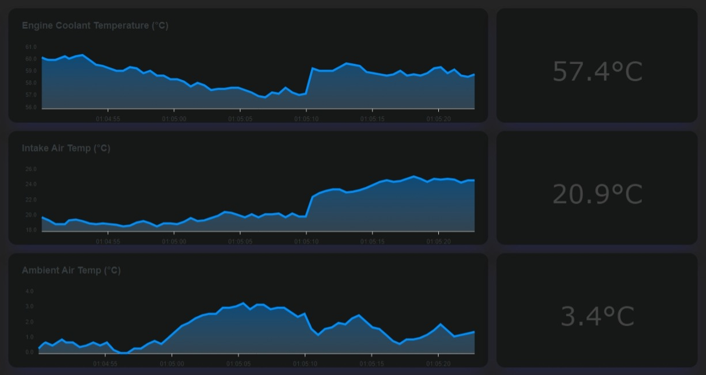

# Car Dashboard Project
## Overview
This project is a car dashboard built using Next.js, designed to display real-time data retrieved from the OBD-II port of your car 🚗. The primary goals of this project are to gain a better understanding of real-time data handling 📊, data storage 🗄️, and management, while also providing an opportunity to practice and enhance my front-end development skills.

## Demonstration

Demonstrations, including images and videos, will be added soon. Here are some images with dummy data for now.







## Usage 

To get started, you'll need an OBD2 Scanner. I'm using a Bluetooth scanner, specifically this one: [VEEPEAK OBD](https://a.co/d/1LcwUQD). It's been reliable, but remember to unplug it once you're finished using it.

Additionally, you'll also need a computer. I make use of both my laptop and Raspberry Pi. When working with the Raspberry Pi, I have it hook up to a 7-inch touchscreen monitor specifically designed for it: [Freenove 7 Inch Touchscreen Monitor for Raspberry Pi](https://a.co/d/ac74IBm). It works great, and I've even designed a 3D-printed case, which I plan to share here later for anyone interested in printing it.

``` todo ```

## Contributing

Feel free to contribute to this project if you are interested.

### Desktop Application

If you prefer working with desktop applications (which is the preferred method for this use case), follow these steps:

1. Install necessary dependencies:

    ```bash
    npm install
    ```

2. Next, I suggest running the Python script `test_app.py` to send fake data through Websocket to aid development. You have two options for running the script:

    - **Using Docker**: Run the following command:

        ```bash
        docker compose up api
        ```

    - **Running Locally**: If you don't have Docker installed, you can run the script locally. Start by creating a virtual environment for Python and installing the required dependencies:

        ```bash
        pip install -r requirements.txt
        ```

3. Once the Python script is running using one of the methods suggested above, open a new terminal and execute the following command:

    ```bash
    npm run tauri dev
    ```

### Web Application

If you prefer working with web applications, I highly suggest using Docker. Make sure you have Docker installed on your development device, and simply run:

```
docker compose up
```

## What's next? 

- Implement new pages.
    - Enhance car statistics with additional metrics.
    - Create a page to display hardware resource data, such as Raspberry Pi performance metrics.
- Store the data in a database for further data analysis.


